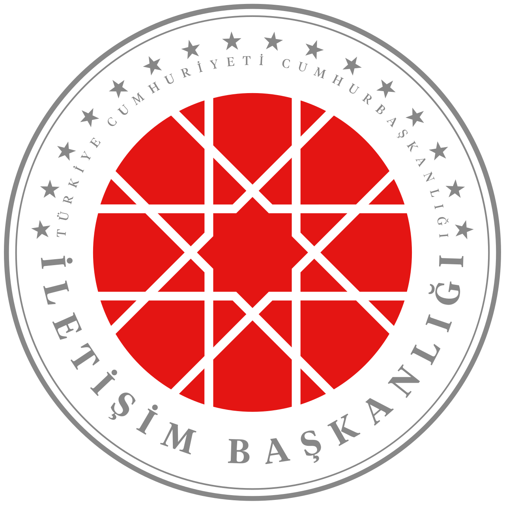

<div align="center">
  

# CİBS — CİB Simultane

**Tamamen yerel çalışan anlık konuşma tanıma ve simultane çeviri**

Apple Silicon (M1–M4) için saf Rust + MLX ile yazılmıştır.
Hiçbir ses kaydı, transkript veya çeviri cihaz dışına çıkmaz.

</div>

---

## Veri Gizliliği

CİBS, toplantı ve görüşme içeriklerinin bulut ortamına çıkmaması gereken
kurumlar için tasarlanmıştır:

- **Tüm işlem cihaz üzerinde:** Konuşma tanıma da çeviri de Mac'in kendi
  GPU'sunda (Metal) çalışır. Google, OpenAI, DeepL gibi hiçbir dış servise
  istek atılmaz.
- **İnternet yalnızca kurulumda gerekir:** Modeller bir kez indirildikten
  sonra sistem tamamen çevrimdışı çalışır; ağ bağlantısı kesilse bile
  çalışmaya devam eder.
- **Sunucu dışarıya kapalıdır:** Varsayılan olarak yalnızca `127.0.0.1`
  adresine bağlanır; ağdaki başka cihazlar erişemez.
- **Kayıt tutulmaz:** Ses ve metinler bellekte işlenir, diske yazılmaz.

## Özellikler

- Canlı mikrofon dinleme: konuştukça ekranda transkript ve seçilen dile
  **anlık çeviri** (tarayıcı arayüzü ile)
- 11 dilde konuşma tanıma (Türkçe, İngilizce, Arapça, Çince, Rusça, Almanca,
  Fransızca, İspanyolca, Japonca, Korece, ...) — otomatik dil algılama
- Yerel çeviri: Qwen3 instruct modeli aynı motorla çalışır
- Dosyadan transkripsiyon (wav/mp3/m4a/flac, `ffmpeg` üzerinden)
- OpenAI uyumlu HTTP API (`POST /v1/audio/transcriptions`)
- Python/PyTorch gerektirmez; iki adet bağımsız binary: `cibs` (CLI) ve
  `cibs-server` (web arayüzü + API)

Performans: M serisi işlemcilerde 0.6B ASR modeli gerçek zamanın çok altında
çalışır (RTF ~0.1–0.2). 4-bit kuantize çeviri modeliyle (önerilen) çeviri
gecikmesi tipik olarak 0,5–1 saniyedir; MLX kuantize checkpoint'leri
(`mlx-community/...-4bit`) doğrudan yüklenir.

## Kurulum

### 1. Gereksinimler

- Apple Silicon Mac (M1–M4), macOS 14+
- [Rust](https://rustup.rs) 1.80+
- Xcode Command Line Tools ve CMake, ffmpeg:

```bash
xcode-select --install
brew install cmake ffmpeg
```

### 2. Kaynağı alın ve derleyin

```bash
git clone https://github.com/bugraayancom/cibs.git
cd cibs
cargo build --release
```

Binary'ler `target/release/cibs` ve `target/release/cibs-server` olarak
oluşur. MLX kütüphanesi (`vendor/mlx`) repoyla birlikte gelir; ek kurulum
gerekmez.

### 3. Modelleri indirin (tek seferlik)

```bash
pip install -U "huggingface_hub[cli]"   # veya: brew install huggingface-cli

mkdir -p models
# Konuşma tanıma modeli (~2 GB)
huggingface-cli download Qwen/Qwen3-ASR-0.6B --local-dir ./models/Qwen3-ASR-0.6B
# Çeviri modeli — 4-bit kuantize (~1 GB, önerilen: 5-20x daha hızlı üretim)
huggingface-cli download mlx-community/Qwen3-1.7B-4bit --local-dir ./models/Qwen3-1.7B-4bit
```

Tam hassasiyetli (bf16) çeviri modeli tercih ederseniz
`Qwen/Qwen3-1.7B` (~4 GB) de kullanılabilir; motor, `config.json` içindeki
`quantization` alanına bakarak iki formatı da otomatik tanır.

Bu adımdan sonra internet bağlantısı gerekmez.

### 4. Başlatın

```bash
./target/release/cibs-server \
  --model-dir ./models/Qwen3-ASR-0.6B \
  --translator-dir ./models/Qwen3-1.7B-4bit
```

Tarayıcıda `http://127.0.0.1:8080` adresini açın, **Dinlemeye başla**
düğmesine basın ve konuşun. Üst kutuda seçtiğiniz dile çeviri, alt kutuda
duyulan transkript anlık olarak güncellenir. İlk kullanımda macOS mikrofon
izni isteyecektir.

## Komut satırı (CLI)

```bash
# Dosyadan transkripsiyon
./target/release/cibs ./models/Qwen3-ASR-0.6B kayit.mp3

# Transkripsiyon + Türkçeye çeviri
./target/release/cibs ./models/Qwen3-ASR-0.6B kayit.mp3 \
  --translate-to tr --translator-dir ./models/Qwen3-1.7B-4bit

# Canlı mikrofon (terminalden)
./target/release/cibs ./models/Qwen3-ASR-0.6B --live \
  --translate-to tr --translator-dir ./models/Qwen3-1.7B-4bit
```

Canlı modda mevcut satır yerinde güncellenir; segment dolunca satır
sabitlenir ve altına `→ <çeviri>` yazılır. `--language tr` ile konuşma dili
sabitlenebilir, `--device N` ile mikrofon seçilebilir
(listelemek için: `ffmpeg -f avfoundation -list_devices true -i ""`).

## API

OpenAI Whisper API'si ile uyumludur; mevcut istemciler doğrudan çalışır.

- `GET /health` — durum kontrolü
- `GET /v1/models` — model listesi
- `WS /v1/live` — canlı akış (web arayüzünün kullandığı WebSocket; istemci ham
  PCM gönderir — 16 kHz mono f32le — sunucu `partial`/`commit` JSON mesajları
  döner; zorunlu önekli artımlı çözümleme sayesinde adım gecikmesi ~0,3-0,5 sn)
- `POST /v1/translate` — JSON `{"text": "...", "target": "tr"}` → `{"translation": "..."}`
- `POST /v1/audio/transcriptions` — multipart form:
  - `file` (zorunlu): ses dosyası
  - `language` (isteğe bağlı): konuşma dili (`tr`, `en`, ... veya tam ad)
  - `translate_to` (isteğe bağlı): hedef çeviri dili
  - `response_format`: `json` (varsayılan) | `text` | `verbose_json`

```bash
curl -F file=@kayit.wav -F translate_to=tr \
  http://127.0.0.1:8080/v1/audio/transcriptions
# → {"text":"...", "translation":"..."}
```

```python
from openai import OpenAI

client = OpenAI(base_url="http://127.0.0.1:8080/v1", api_key="kullanilmiyor")
with open("kayit.wav", "rb") as f:
    r = client.audio.transcriptions.create(model="cibs", file=f)
print(r.text)
```

İsteğe bağlı `--api-key <anahtar>` ile Bearer doğrulaması açılabilir.

## Mimari

```
mikrofon / dosya
  → ffmpeg (16 kHz mono PCM)
  → log-mel spektrogram (128 bant)
  → Qwen3-ASR ses kodlayıcı (Conv2D + transformer)  ┐
  → Qwen3 çözücü (GQA, KV cache) → transkript        │ MLX / Metal GPU
  → Qwen3-1.7B çeviri modeli → hedef dilde metin     ┘
```

- Ağırlıklar HuggingFace safetensors formatından doğrudan yüklenir.
- Canlı mod, Qwen3-ASR'nin resmî akış reçetesini uygular: biriken ses her
  adımda yeniden kodlanır, önceki metin son 5 token hariç "zorunlu önek"
  olarak korunur.
- Çeviri, aynı Rust çözücü implementasyonuyla çalışan bağımsız bir Qwen3
  instruct modelidir; `--translator-dir` ile istenen boyut seçilebilir
  (0.6B hızlı / 1.7B dengeli / 4B yüksek kalite).
- 4/8-bit MLX kuantize ağırlıklar desteklenir: kuantize katmanlar
  `quantized_matmul` ile doğrudan paketlenmiş halde çalıştırılır
  (dequantize edilmez), bu da üretimi hızlandırıp belleği ~4'te 1'e indirir.

## Testler

```bash
cargo test --release
# İndirilmiş model gerektiren uçtan uca testler:
cargo test --release --test e2e_test -- --ignored --nocapture
```

## English summary

CİBS (CİB Simultane) is a fully local, real-time speech transcription and
translation tool for Apple Silicon, written in pure Rust on MLX. Audio,
transcripts, and translations never leave the device: both the Qwen3-ASR
speech model and the Qwen3 translation model run on the Mac's own GPU, the
bundled server binds to localhost only, and the network is needed just once
to download the models. Build with `cargo build --release`, download the two
models from HuggingFace, start `cibs-server`, and open
`http://127.0.0.1:8080` in a browser.

## Lisans

MIT veya Apache-2.0 (dilediğinizi seçebilirsiniz). Ayrıntılar için
[LICENSE-MIT](LICENSE-MIT) ve [LICENSE-APACHE](LICENSE-APACHE) dosyalarına
bakın. Model ağırlıkları (Qwen3-ASR, Qwen3) Alibaba/Qwen'in kendi
lisanslarına tabidir.
